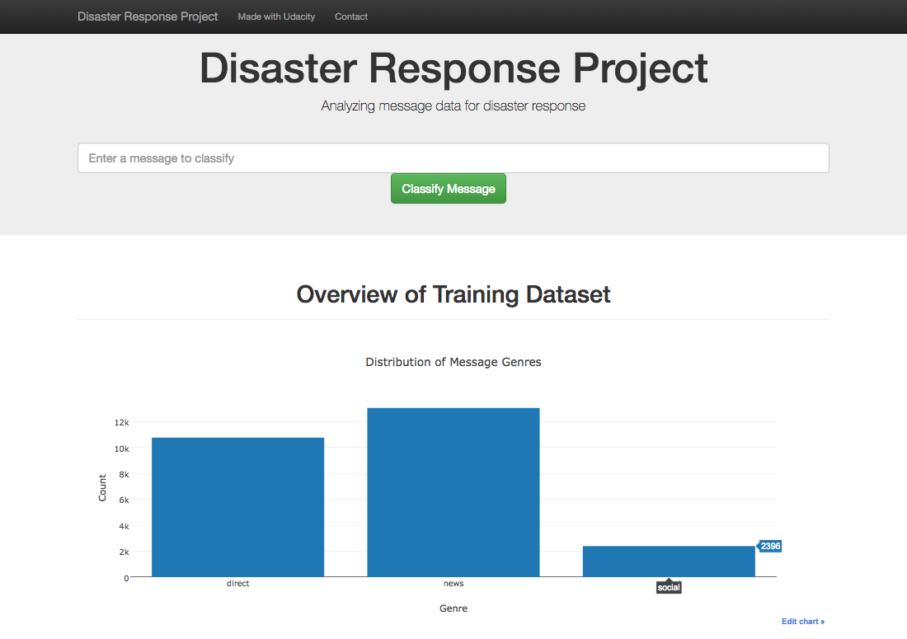
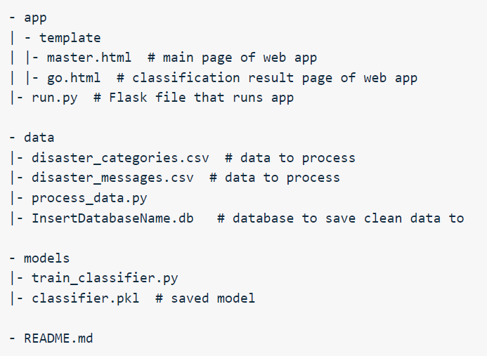

# Disaster Response Pipeline Project

### Summary
The aim of this project is to create a machine learning pipeline to categorize real messages that were sent during disaster events, so that we can send the messages to an appropriate disaster relief agency.

### Instructions:
1. Run the following commands in the project's root directory to set up your database and model.

    - To run ETL pipeline that cleans data and stores in database
        `python data/process_data.py data/disaster_messages.csv data/disaster_categories.csv data/DisasterResponse.db`
    - To run ML pipeline that trains classifier and saves
        `python models/train_classifier.py data/DisasterResponse.db models/classifier.pkl`

2. Run the following command in the app's directory to run your web app. python run.py

3. Go to http://0.0.0.0:3001/

### Files

